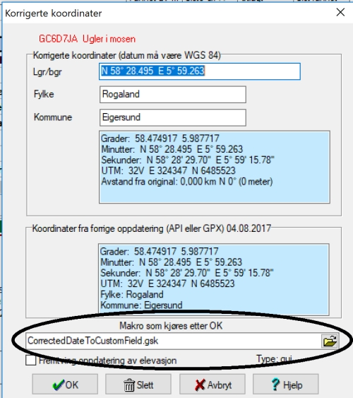

# CopyCorrectedToGeocachingCom

## Installasjonsveiledning

* Start med å laste ned og installere makroen [CorrectedDateToCustomField](http://gsak.net/board/index.php?showtopic=26381&st=0&#entry199014) fra Gsaks hjemmeside.
* Sett så inn at denne makroen skal kjøres ved hver oppdatering av korrigerte koordinater, se bilde. 
* Installer så makroen **CopyCorrectedToGeocachingCom** og ved første gangs kjøring vil denne laste opp koordinater for samtlige cacher i databasen som har endrede koordinater.

## Info

* Makroen benytter to datofelter:
  * CorrDate - Dato for når korrigerte koordinater er satt.  
  Settes til dagens dato når man oppdaterer koordinater på en cache.
  * CorrUpdate - Dato for når koordinater er lastet opp til geocaching.com.  
  Settes av CopyCorrectedToGeocachingCom når koordinater er lastet opp til geocaching.com.
* Ved kjøring oppdateres cacher hvor _CorrDate_ er nyere eller lik _CorrUpdate_. Dette betyr at man vil se at makroen oppdaterer de samme cachene flere ganger dersom man kjører denne makroen samme dag som cachens koordinater blir oppdatert.
* Dersom man sletter korrigerte koordinater vil dette fanges av makroen, og ved neste kjøring slettes da de korrigerte koordinatene fra geocacheing.com
